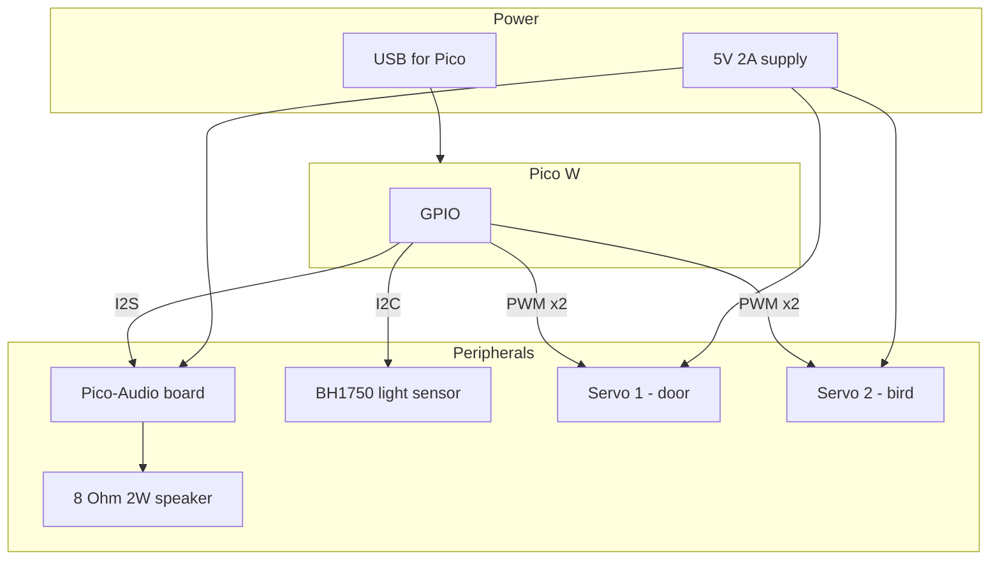

# Wiring and Integration – Smart Cuckoo Clock (Pico W)

This document describes how to connect the Raspberry Pi Pico W, Waveshare Pico-Audio, BH1750 light sensor, MG90S servos, speaker, and power supply. Keep pin assignments in sync with [code/config.py](../code/config.py).

---

## Block diagram

---

## Pin table

| Function        | GPIO (BCM) | Pin name | Voltage | Notes                    |
|----------------|------------|----------|---------|--------------------------|
| Servo 1 (door) | GP14       | Pin 19   | 3.3V*   | PWM; door open/close     |
| Servo 2 (bird) | GP15       | Pin 20   | 3.3V*   | PWM; bird in/out         |
| I2C SDA        | GP16       | Pin 21   | 3.3V    | BH1750 data              |
| I2C SCL        | GP17       | Pin 22   | 3.3V    | BH1750 clock             |
| I2S DIN        | GP26       | Pin 31   | 3.3V    | Pico-Audio data (see note)|
| I2S BCK        | GP27       | Pin 32   | 3.3V    | Pico-Audio bit clock     |
| I2S LRCK       | GP28       | Pin 34   | 3.3V    | Pico-Audio word clock    |

\* MG90S may accept 3.3V PWM; if not, use a 5V-compatible PWM driver or level shifter. Power to servos remains 5V from the external supply.

**Pico-Audio version:** The table above matches the **initial** Waveshare Pico-Audio (PCM5101A). If you have **Rev2.1** (CS4344), DIN is GP22, and MCLK/SCLK use GP26/GP28 – see [Waveshare Pico-Audio wiki](https://www.waveshare.com/wiki/Pico-Audio) and update [code/config.py](../code/config.py) accordingly.

**Quartz clock movement:** No electrical connection to the Pico. Battery-powered; long shaft passes through the clock face. Mount mechanically in the enclosure.

---

## Power

- **5V 2A supply:** Use for servos (and optionally for Pico-Audio VSYS). Prevents Pico brownouts when servos move.
- **Pico W:** Powered via USB, or via VSYS if you feed 5V from the same supply (through a suitable regulator if required). **All grounds must be common** (Pico GND, Pico-Audio GND, servo GND, 5V supply GND).
- **BH1750:** 3.3V from Pico 3V3(OUT), GND to Pico GND.
- **Pico-Audio:** VSYS (5V) and 3V3(OUT) from Pico for logic; see Waveshare docs for stack connection.

---

## Peripheral wiring

### Pico-Audio (Waveshare)

- **Connection:** Stack onto Pico W (USB port orientation as per Waveshare diagram), or wire manually.
- **Power:** VSYS and 3V3(OUT) and GND from Pico (stack provides these).
- **I2S:** DIN → GP26, BCK → GP27, LRCK → GP28 (initial board). Rev2.1 uses GP22, GP26, GP27, GP28 – check your board.
- **Speaker:** Connect 8 Ω 2W speaker to the board’s speaker outputs (L+/L− or single channel as per board labeling).

### BH1750 (I2C light sensor)

- **VCC** → Pico 3V3(OUT)
- **GND** → Pico GND
- **SDA** → Pico GP16
- **SCL** → Pico GP17
- **Address:** 0x23 (default); some boards use 0x5C with ADDR pin tied high.

### MG90S servos (×2)

- **Servo 1 (door):** Signal → GP14, V+ → 5V supply, GND → common GND.
- **Servo 2 (bird):** Signal → GP15, V+ → 5V supply, GND → common GND.
- Ensure 5V supply can deliver enough current for both servos under load. Do not power servos from Pico’s 3V3/5V pins if drawing more than ~100 mA total.

### Quartz movement

- Mechanical only. Install so the long shaft passes through the face; no wires to Pico.

---

## Assembly order (quick reference)

1. **Mount Pico W** in the enclosure (or on a bench for testing).
2. **Stack or connect Pico-Audio** and confirm jumpers (if any) per Waveshare instructions.
3. **Connect I2C:** SDA (GP16), SCL (GP17), 3V3, GND to BH1750.
4. **Connect servos:** PWM (GP14, GP15), 5V and GND from the 5V 2A supply.
5. **Connect speaker** to Pico-Audio speaker outputs.
6. **Connect 5V supply** to servos (and Pico-Audio VSYS if used); tie all GND together.
7. **Power Pico** via USB (or VSYS as planned).
8. **Place quartz movement** so its shaft goes through the face; secure mechanically.

For detailed pin and voltage reference, use the **Pin table** above and the [Waveshare Pico-Audio wiki](https://www.waveshare.com/wiki/Pico-Audio) for your board revision.
